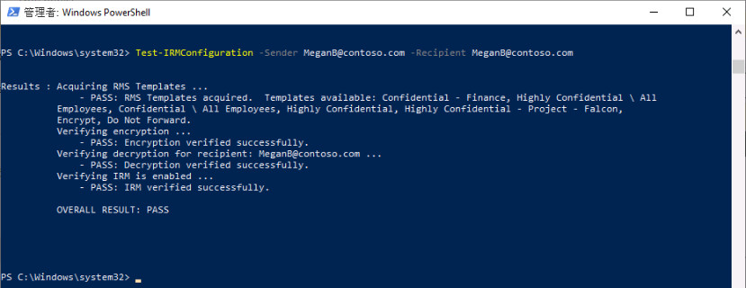

# ラボ 1 演習 2 - Office 365 Message Encryption を管理する

ジョニ・シャーマンがパイロット チームで構成しテストする必要がある最初の設定は、Microsoft 365 の組み込みの Office 365 Message Encryption (OME) です。この目的のために、彼女は既定のテンプレートを変更し、パイロット ユーザーの 1 人に割り当てられる新しいブランド テンプレートを作成します。次に、パイロット ユーザーは各自のアカウントで OME 機能をテストします。

### タスク 1 – Azure RMS の機能を確認する

このタスクでは、Exchange Online PowerShell モジュールをインストールし、前回の演習でコンプライアンス管理者のロールが割り当てられたジョニ・シャーマンとして、自分のテナントの Azure RMS の機能が正しいことを確認します。

1. Client 1 VM (LON-CL1) に **lon-cl1\admin** アカウントでログインしておきます。

```
この演習は、PC に PowerShell モジュールをインストールしますので、ラボの仮想マシンを使用してください。
```

2. Windows ボタンを右クリックして、**Windows PowerShell (管理者)** を選択します。

3. 「**ユーザー アカウント制御**」 ウィンドウで、「**はい**」 を選択します。

4. 次のコマンドレットを入力して、Exchange Online PowerShell モジュールの最新版をインストールします。

    `Install-Module ExchangeOnlineManagement`

5. **NuGet プロバイダー** セキュリティ ダイアログが表示されたら **Y** と回答し、**Enter** キーを押します。この処理は、完了するまでに数秒かかる場合があります。

6. **信頼されていないレポジトリ** セキュリティ ダイアログが表示されたら **Y** で確認し、**Enter** キーを押します。  この処理は、完了するまでに数秒かかる場合があります。

7. 次のコマンドレットを入力して実行ポリシーを変更し、**Enter** キーを押します。

    `Set-ExecutionPolicy -ExecutionPolicy RemoteSigned -Scope CurrentUser`

8. **実行ポリシーの変更** を「はい」を示す **Y** で確認し、**Enter** キーを押します。 

9. PowerShell ウィンドウを閉じます。

10. Windows ボタンを右クリックして、通常の **Windows PowerShell** を選択します。

11. 次のコマンドレットを入力して Exchange Online PowerShell モジュールを使用し、テナントに接続します。

    `Connect-ExchangeOnline`

12. 「**サインイン**」 ウィンドウが表示されたら、JoniS@WWLxZZZZZZ.onmicrosoft.com (ZZZZZZ はラボ ホスティング プロバイダーから支給された固有のテナント ID) としてサインインします。  Joni のパスワードは、管理者と同じです。

13. 次のコマンドレットを使用して、テナントで Azure RMS(Rights Management Service) および IRM(Information Rights Management) がアクティブ化されていることを確認します。

    ```
    Get-IRMConfiguration | fl AzureRMSLicensingEnabled
    ```

1. 次のコマンドレットを使用して、テナントで使用可能なテンプレートの一覧を核にします。

     ```
     Get-RMSTemplate
     ```
    
14. Office 365 Message Encryption に使われる Azure RMS テンプレートを次のコマンドレットを使用して、パイロット ユーザー **Megan Bowen** に対してテストします。

    `Test-IRMConfiguration -Sender MeganB@contoso.com -Recipient MeganB@contoso.com`

    

15. すべてのテストが **合格** のステータスであり、エラーが表示されていないことを確認します。

16. PowerShell ウィンドウは開いたままにします。

Exchange Online PowerShell モジュールがインストールされ、テナントに接続し、Azure RMS が正しく機能していることを確認しました。

### タスク 2 - 既存のメールフロー の設定を確認する
ここでは、既存のメールフローの動作を確認します。

1. https://admin.exchange.microsoft.com/ にアクセスし、**admin@... ** でログインします。

2. **メールフロー** で **ルール** を選択します

3. ルール一覧で、**Protect with OMEv2** を選択し、鉛筆アイコンをクリックして編集画面を表示します。

4. 「**このルールを適用する条件**」で「**件名または本文に次の語句が含まれる**」が選択されており、横に「**OMEv2**」が表示されていることを確認します。これは、本文に「OMEv2」という文字列が書かれている場合にこのルールを適用することを意味しています。

5. 「**実行する処理**」で「**次のテンプレートで Office 365 Message Encryption と権利保護をメッセージに適用する**」が選択されており、その横に「**Do Not Forward（転送不可）**」が表示されていることを確認してください。

6. 「**キャンセル**」をクリックしてウィンドウを閉じます。

### タスク 4 – カスタム ブランド テンプレートを作成し、メールフローに組み込む

組織の財務部が送信する、保護されたメッセージには、カスタマイズした導入や本文、フッターの免責事項のリンクなど、**特別なブランド化**が必要です。財務のメッセージはまた、**7 日経過した後期限切れ**とします。このタスクでは、OME 構成を新しくカスタマイズし、財務部が送信するすべてのメールに対しその OME 構成を適用する転送ルールを作成します。

1. Client 1 VM (LON-CL1) には **lon-cl1\admin** アカウントでログインし、Exchange Online が接続された状態の PowerShell ウィンドウが開いている必要があります。

2. 次のコマンドレットを実行して、新しい OME 構成を作成します。このコマンドではメッセージの有効期限を設定しています。

   ```
   New-OMEConfiguration -Identity "Finance Department" -ExternalMailExpiryInDays 7
   ```

3. テンプレートをカスタマイズすることに関する警告メッセージに「**Y**」で応答し、**Enter** キーを押します。 

4. 導入のテキストメッセージを次のコマンドレットで変更します。

    ```
    Set-OMEConfiguration -Identity "Finance Department" -IntroductionText " from Contoso Ltd. finance department has sent you a secure message."
    ```

5. テンプレートをカスタマイズすることに関する警告メッセージに「**Y**」で応答し、**Enter** キーを押します。

6. メッセージの本文メールテキストを次のコマンドレットで変更します。

    ```
    Set-OMEConfiguration -Identity "Finance Department" -EmailText "Encrypted message sent from Contoso Ltd. finance department.Handle the content responsibly."
    ```

7. テンプレートをカスタマイズすることに関する警告メッセージに「**Y**」で応答し、**Enter** キーを押します。

8. 免責事項 URL を変更し、Contoso のプライバシーに関する声明のサイトを指し示すようにします。

    ```
    Set-OMEConfiguration -Identity "Finance Department" -PrivacyStatementURL "https://contoso.com/privacystatement.html"
    ```

9. テンプレートをカスタマイズすることに関する警告メッセージに「**Y**」で応答し、**Enter** キーを押します。

10. 次のコマンドレットを実行して、テンプレートの設定を確認します。**SocialIdSignIn** と **OTPEnabled** の両方が **True** であることを確認します。

    ```
    Get-OMEConfiguration -Identity "Finance Department" |fl
    ```

11. 次のコマンドレットを使用し、**メール フロー ルール**を作成します。この**メール フロー ルール**は財務チームが送信するメッセージすべてにカスタム OME テンプレートを適用します。  この処理は、完了するまでに数秒かかる場合があります。このフロールールにより、財務チームが送信する全てのメッセージは自動的に暗号化されます。

    ```
    New-TransportRule -Name "Encrypt all mails from Finance team" -FromScope InOrganization -FromMemberOf "Finance Team" -ApplyRightsProtectionCustomizationTemplate "Finance Department" -ApplyRightsProtectionTemplate Encrypt
    ```

12. PowerShell は開いたままにします。

財務部のメンバーが外部の受信者にメッセージを送信する際に、カスタム OME テンプレートが自動的に適用される転送ルールが新しく作成されました。

### タスク 5 – カスタム ブランド テンプレートをテストする

新しい、カスタム OME 構成を検証するため、財務チームのメンバーである **Lynne Robbins** のアカウントを利用する必要があります。

1. Client 2 VM (LON-CL2) には **lon-cl2\admin** アカウントでログインし、Microsoft 365(https://portal.office.com) には **Lynne Robbins (LynneR@WWLx653641.OnMicrosoft.com)** としてログインしておく必要があります。 

2. outlook で、**New message**を選択します。

3. 「**To**」 に、テナント ドメインにない、個人用またはその他サード パーティのメール アドレスを入力します。件名に 「**財務レポート**」、本文には 「**秘密の財務情報**」 を入力します。

4. 「**Send**」 を選択して、メッセージを送信します。メールが到達するまでに 3 分程度要するかもしれません。

5. 個人用のメール アカウントにサインインし、Lynne Robbins からのメッセージを開きます。

6. 以下の画像のような Lynne Robbins からのメッセージとなるはずです。  「**Read the message**」 を選択します。

    

7. 「**ソーシャル ID**」と「**ワンタイムパスコード**」によるログインが表示されていることを確認します。「**ワンタイム パスコードを使用してサインイン**」 を選択して、制限時間付きパスコードを受け取ります。

9. 個人用のメール ボックス開き、「**Your one-time passcode to view the message**」 という件名のメッセージを開きます。

10. パスコードをコピーして、OME ポータルにペーストし、「**Continue**」 を選択します。

11. カスタム ブランドの暗号化されたメッセージを確認します。

新しくカスタマイズされた OME テンプレートがテストされました。 

# 演習 3 に進みます。 
