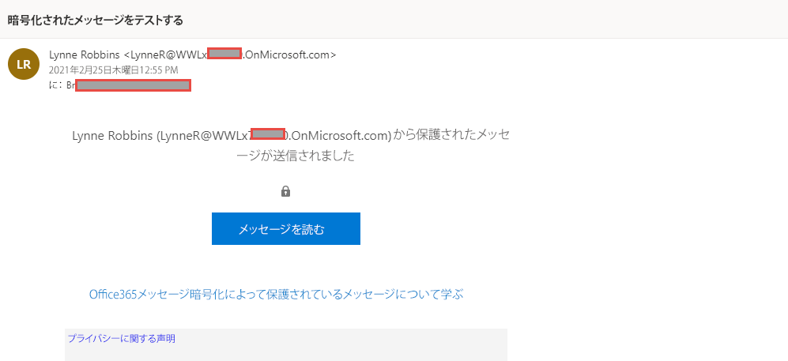

# ラボ 1 演習 2 - Office 365 Message Encryption を管理する

ジョニ・シャーマンがパイロット チームで構成しテストする必要がある最初の設定は、Microsoft 365 の組み込みの Office 365 Message Encryption (OME) です。この目的のために、彼女は既定のテンプレートを変更し、パイロット ユーザーの 1 人に割り当てられる新しいブランド テンプレートを作成します。次に、パイロット ユーザーは各自のアカウントで OME 機能をテストします。

### タスク 1 – Azure RMS の機能を確認する

このタスクでは、Exchange Online PowerShell モジュールをインストールし、前回の演習でコンプライアンス管理者のロールが割り当てられたジョニ・シャーマンとして、自分のテナントの Azure RMS の機能が正しいことを確認します。

1. Client 1 VM (LON-CL1) に **lon-cl1\admin** アカウントでログインしておきます。

2. マウスの右ボタンで Windows ボタンを選択して管理者特権の PowerShell ウィンドウを開いてから、「**Windows PowerShell (管理者)**」を選択します。

3. **「ユーザー アカウント制御」** ウィンドウで、**「はい」** を選択します。

4. 次のコマンドレットを入力して、Exchange Online PowerShell モジュールの最新版をインストールします。

    `Install-Module ExchangeOnlineManagement`

5. NuGet プロバイダー セキュリティ ダイアログを「はい」を示す **Y** で確認し、**Enter** キーを押します。この処理は、完了するまでに数秒かかる場合があります。

6. 信頼されていないレポジトリ セキュリティ ダイアログを「はい」を示す **Y** で確認し、**Enter** キーを押します。  この処理は、完了するまでに数秒かかる場合があります。

7. 次のコマンドレットを入力して実行ポリシーを変更し、**Enter** キーを押します。

    `Set-ExecutionPolicy -ExecutionPolicy RemoteSigned -Scope CurrentUser`

8. 実行ポリシーの変更を「はい」を示す **Y** で確認し、**Enter** キーを押します。 

9. PowerShell ウィンドウを閉じます。

10. マウスの右ボタンで Windows ボタンを選択して通常の PowerShell ウィンドウを開き、**Windows PowerShell** を選択します。

11. 次のコマンドレットを入力して Exchange Online PowerShell モジュールを使用し、テナントに接続します。

    `Connect-ExchangeOnline`

12. **「サインイン」** ウィンドウが表示されたら、JoniS@WWLxZZZZZZ.onmicrosoft.com (ZZZZZZ はラボ ホスティング プロバイダーから支給された固有のテナント ID) としてサインインします。  Joni のパスワードは、ラボ ホスティング プロバイダーから支給されます。

13. 次のコマンドレットを使用して、テナントで Azure RMS および IRM がアクティブ化されていることを確認し、**Enter** キーを押します。

    `Get-IRMConfiguration | fl AzureRMSLicensingEnabled`

14. Office 365 Message Encryption に使われる Azure RMS テンプレートを次のコマンドレットを使用して、もう一方のパイロット ユーザー **Megan Bowen** に対してテストし、**Enter** キーを押します。

    `Test-IRMConfiguration -Sender MeganB@contoso.com`

15. すべてのテストが PASS のステータスであり、エラーが表示されていないことを確認します。

16. PowerShell ウィンドウは開いたままにします。

Exchange Online PowerShell モジュールがインストールされ、テナントに接続し、Azure RMS が正しく機能していることを確認しました。

### タスク 2 - 既定の OME テンプレートを修正する

組織からは Google や Facebook などの ID プロバイダーへの信頼を制限する要件が出されています。既定では、このようなソーシャル ID は OME で保護されたメッセージにアクセスするためにアクティブ化されるので、組織内のすべてのユーザーに対してソーシャル ID の利用を非アクティブ化する必要があります。  

1. Client 1 VM (LON-CL1) には **lon-cl1\admin** アカウントでログインし、Exchange Online が接続された状態の PowerShell ウィンドウが開いている必要があります。

2. 次のコマンドレットを実行して、既定の OME 構成を閲覧します。

    `Get-OMEConfiguration -Identity "OME Configuration" |fl`

3. 設定を確認して、SocialIdSignIn のパラメーターが「True」に設定されていることを確認します。

4. 次のコマンドレットを実行し、OME で保護されたテナントからのメッセージにアクセスするためのソーシャル ID の利用を制限します。

    `Set-OMEConfiguration -Identity "OME Configuration" -SocialIdSignIn:$false`

5. 既定のテンプレートをカスタマイズすることに関する警告メッセージを、「はい」を示す **Y** で確認し、**Enter** キーを押します。

6. 既定の構成をもう一度確認し、SocialIdSignIn のパラーメーターが「False」に設定されていることを確認します。

    `Get-OMEConfiguration -Identity "OME Configuration" |fl`

7. 結果に SocialIDSignIn が「False」が設定されていることが表示されていることに注意してください。PowerShell ウィンドウとクライアントは開いたままにします。

Office 365 Message Encryption での Google、Facebook などの海外の ID プロバイダーの利用を非アクティブ化しました。

### タスク 3 - 既定の OME テンプレートをテストする

テナントのユーザーから Office 365 Message Encryption で保護されたメッセージを受信する際は、ソーシャル ID ダイアログが外部の受信者に対して表示されていないことを確認する必要があります。

1.	Client 2 VM (LON-CL2) に **lon-cl2\admin** アカウントでログインします。

2.	タスクバーから **Microsoft Edge** を開き、**「新しい Microsoft Edge へようこそ」** のウインドウが表示されたら、 **「完全セットアップ」** を選択します。

3. **「確認」** を選択して、デフォルトのブラウザー設定を承認したら、**「サインインしないで続行」** します。

4. **Microsoft Edge** で、**https://outlook.office.com** に移動し、LynneR@WWLxZZZZZZ.onmicrosoft.com として Outlook on the web にログインします (ZZZZZZ はラボ ホスティング プロバイダーから支給された固有のテナント ID)。  Lynne Robin のパスワードは、ラボ ホスティング プロバイダーから支給されます。ヒント: 通常、これはラボ テナントの MOD 管理者のパスワードと同じです。

5. **「サインインの状態を維持しますか?」** ダイアログボックスで、**「今後このメッセージを表示しない」** チェックボックスを選択し、**「いいえ」** を選択します。

6. **「パスワードを保存」** ダイアログで、**「保存」** を選択し、ブラウザーにパイロット ユーザーのパスワードを保存します。

7. **「翻訳元の言語...」** ウィンドウが表示されたら、下向きの矢印を選択し、**「...からは翻訳しない」** を選択します。

8. Outlook on the web の左上部から**新規メッセージ**を選択します。

9. **「To」** に、テナント ドメインにない、個人用またはその他サード パーティのメール アドレスを入力します。件名に **「秘密のメッセージ」**、本文に **「私の重大な秘密のメッセージ。」** と入力します。

10. 上部のウィンドウから、**暗号化**を選択し、メッセージを暗号化します。  メッセージが暗号化されると、メッセージが暗号化された旨を伝える通知が表示されます。

11. **「送信」** を選択して、メッセージを送信します。

12. 個人用のメール アカウントにサインインし、Lynne Robbins からのメッセージを開きます。  Microsoft アカウント (@outlook.comなど) にこのメールを送った場合、暗号化は自動的に行われる可能性があり、メッセージが自動的に表示されます。  メールを他のメール サービス (@google.com) に送信した場合、暗号化を処理し、メッセージを読むために、次の手順を踏む必要がある可能性があります。

13. **「メッセージを読む」** を選択します。

14. ソーシャル IDをアクティブ化しなければ、Google アカウントで認証するボタンはありません。

15. **「ワンタイム パスコードを使用してサインイン」** を選択して、制限時間付きパスコードを受け取ります。

16. 個人用のメール ポータルを開き、**「メッセージを表示するためのワンタイム パスコード」** という件名のメッセージを開きます。

17. パスコードをコピーして、OME ポータルにペーストし、**「続行」** を選択します。

18. 暗号されたメッセージを確認します。

修正された、既定の OME テンプレートを非アクティブ化したソーシャル ID でテストしました。

### タスク 4 – カスタム ブランド テンプレートを作成する

組織の財務部が送信する、保護されたメッセージには、カスタマイズした導入や本文、フッターの免責事項のリンクなど、特別なブランド化が必要です。財務のメッセージはまた、7 日経過した後期限切れとします。このタスクでは、OME 構成を新しくカスタマイズし、財務部が送信するすべてのメールに対しその OME l構成を適用する転送ルールを作成します。

1. Client 1 VM (LON-CL1) には **lon-cl1\admin** アカウントでログインし、Exchange Online が接続された状態の PowerShell ウィンドウが開いている必要があります。

2. 次のコマンドレットを実行して、新しい OME 構成を作成します。

    `New-OMEConfiguration -Identity "Finance Department" -ExternalMailExpiryInDays 7` 

3. テンプレートをカスタマイズすることに関する警告メッセージを、「はい」を示す「**Y**」で確認し、**Enter** キーを押します。 

4. 導入のテキストメッセージを次のコマンドレットで変更します。

    `Set-OMEConfiguration -Identity "Finance Department" -IntroductionText " from Contoso Ltd. finance department has sent you a secure message."`

5. テンプレートをカスタマイズすることに関する警告メッセージを、「はい」を示す「**Y**」で確認し、**Enter** キーを押します。

6. メッセージの本文メールテキストを次のコマンドレットで変更します。

    `Set-OMEConfiguration -Identity "Finance Department" -EmailText "Encrypted message sent from Contoso Ltd. finance department.Handle the content responsibly."`

7. テンプレートをカスタマイズすることに関する警告メッセージを、「はい」を示す「**Y**」で確認し、**Enter** キーを押します。

8. 免責事項 URL を変更し、Contoso のプライバシーに関する声明のサイトを指し示すようにします。

    `Set-OMEConfiguration -Identity "Finance Department" -PrivacyStatementURL "https://contoso.com/privacystatement.html"`

9. テンプレートをカスタマイズすることに関する警告メッセージを、「はい」を示す「**Y**」で確認し、**Enter** キーを押します。

10. 次のコマンドレットを使用し、メール フロー ルールを作成します。このメール フロー ルールはカスタム OME テンプレートを財務チームが送信するメッセージすべてに適用します。  この処理は、完了するまでに数秒かかる場合があります。

    `New-TransportRule -Name "Encrypt all mails from Finance team" -FromScope InOrganization -FromMemberOf "Finance Team" -ApplyRightsProtectionCustomizationTemplate "Finance Department" -ApplyRightsProtectionTemplate Encrypt`

11. PowerShell は開いたままにします。

財務部のメンバーが外部の受信者にメッセージを送信する際に、カスタム OME テンプレートが自動的に適用される転送ルールが新しく作成しました。

### タスク 5 – カスタム ブランド テンプレートをテストする

新しい、カスタム OME 構成を検証するため、財務チームのメンバーである Lynne Robbins のアカウントをもう一度利用する必要があります。

1. Client 2 VM (LON-CL2) には **lon-cl2\admin** アカウントでログインし、Microsoft 365 には **Lynne Robbins** としてログインしておく必要があります。 

3. 左側のナビゲーション ウィンドウで **Outlook** の記号を選択します。

4. Outlook on the web の左上部から**新規メッセージ**を選択します。

5. **「To」** に、テナント ドメインにない、個人用またはその他サード パーティのメール アドレスを入力します。件名に *「財務レポート」*、本文には *「秘密の財務情報」* を入力します。

6. **「送信」** を選択して、メッセージを送信します。

7. 個人用のメール アカウントにサインインし、Lynne Robbins からのメッセージを開きます。

8. 以下の画像のような Lynne Robbins からのメッセージとなるはずです。  **「メッセージを読む」** を選択します。

    

9. 両方のオプションが利用可能となり、カスタマイズした OME 構成がソーシャル ID をアクティブ化されます。**「ワンタイム パスコードを使用してサインイン」** を選択して、制限時間付きパスコードを受け取ります。

10. 個人用のメール ポータルを開き、**「メッセージを表示するためのワンタイム パスコード」** という件名のメッセージを開きます。

11. パスコードをコピーして、OME ポータルにペーストし、**「続行」** を選択します。

12. カスタム ブランドの暗号化されたメッセージを確認します。

新しくカスタマイズされた OME テンプレートがテストされました。 

# 演習 3 に進みます。 
