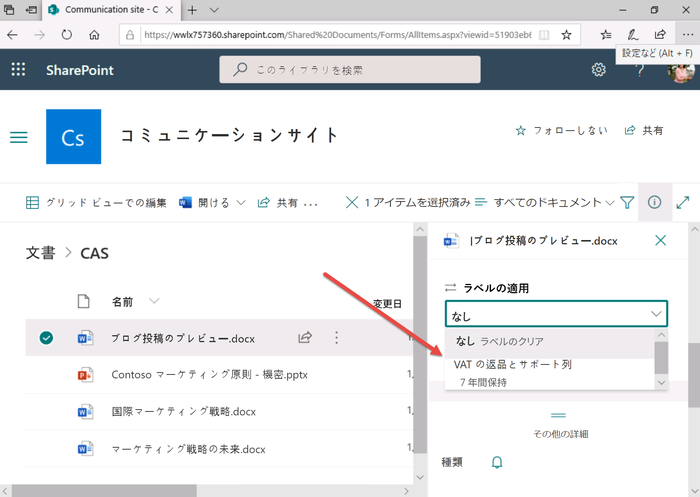

# ラボ 3 演習 2 - 保持ラベルを実装する

このシナリオでは、Contoso Ltd. のシステム管理者である Joni Sherman のロールを実行します。この組織は英国サドベリーにあり、財務関係の文書を保持する法的義務を負っています。 

財務部では保持計画を作成し、証明する書類とクレジット カードの領収書がある付加価値税 (VAT) 還付の書類に保持ラベルを設定しました。
 
### タスク 1 – 保持ラベルを作成する

このタスクでは、VAT の還付を含むドキュメントおよび電子メールに割り当てることができる保持ラベルと、クレジット カードの領収書に適用できる保持ラベルを作成します。

1. Client 1 VM (LON-CL1) に **lon-cl1\admin** アカウントでログインします。

2. **Microsoft Edge** で、**https://compliance.microsoft.com** に移動して、**Joni Sherman** としてコンプライアンス センターにログインします。

3. **コンプライアンス センター**の左側のナビゲーション ウィンドウで「**ポリシー**」を選択し、「**データ**」で「**保持**」を選択します。

4. 「情報ガバナンス」ページで「**ラベル**」タブを選択します。

5. 「**+ ラベルをの作成**」ボタンを選択します。

6. 「**保持ラベルに名前を付ける**」ページで、「**名前**」、「**ユーザー向けの説明**」、「**管理者向けの説明**」に次の情報を入力します。

	- **名前**: VAT の還付と関連書類
	- **ユーザー向けの説明**: このラベルを VAT ドキュメントに割り当てることで、法的に定められた 7 年間の保持されるようにします。
	- **管理者向けの説明**: 7 年間保持される VAT の還付。

7. 「**次へ**」ボタンを選択します。

8. 「**保持設定の定義する**」ページの「**特定の期間アイテムを保持**」設定を有効にします。

9. 「**特定の期間アイテムを保持**」セクションで、次の情報を設定します。
	- **保持期間**: 7 年
	- **保持期間開始の条件**: アイテムの作成日時
	- **保持期間の終了時**: 何もしない

10. 「**次へ**」ボタンを選択します。

11. **「確認と完了」** ページで、**「ラベルの作成」** ボタンを選択します。  **「何もしない」** を選択し、**「完了」** を選択します。

12.「保持ラベルが作成されました」ページで「**何も行わない**」を選択して「**完了**」を選択します。

13. 「**+ ラベルの作成**」ボタンを選択します。

14. 「**保持ラベルに名前を付ける**」ページで、「**名前**」、「**管理者向けの説明**」、「**ユーザー向けの説明**」に次の情報を入力します。
	- **名前**: クレジット カードの領収書
	- **ユーザー向けの説明**: このラベルは、クレジット カードの領収書に自動的に適用され、保持期間は 3 年です。
	- **管理者向けの説明**: クレジット カードの領収書を 3 年間保持するための、自動適用された保持ラベル。

15. 「**次へ**」ボタンを選択します。

16. 「**保持設定の定義**」セクションで、次の情報を設定します。
	- **保持期間**: 3 年
	- **保持期間開始の条件**: アイテムの作成日時
	- **保持期間の終了時**: 何もしない

17. 「**次へ**」ボタンを選択します。

18. **「確認と完了」** ページで、**「ラベルの作成」** ボタンを選択します。**「何もしない」** を選択し、**「完了」** を選択します。

19. 「**保持ラベルが作成されました**」ページで「**何も行わない**」を選択して、「**完了**」を選択します。

7 年間の保持期間を持つ VAT 還付用の保持ラベルと、クレジット カードの領収書用の保持ラベルが正常に作成されました。

### タスク 2 – 保持ラベルを発行する

タスク 1 に続いて、VAT 還付の保持ラベルを発行します。これにより、発行されたラベルを財務ユーザーが Exchange メールや SharePoint ドキュメントにあるドキュメントに適用できるようになります。

1. Client 1 VM (LON-CL1) には **lon-cl1\admin** アカウントでログインし、Microsoft 365 には **Joni Sherman** としてログインしておく必要があります。 

2. **Microsoft Edge** で、「Office 365 コンプライアンス センター」タブを開いておく必要があります。そうなっている場合は、それを選択し、次の手順に進みます。閉じてしまった場合は、新しいタブで **https://compliance.microsoft.com** に移動します。

3. **コンプライアンス センター**の左側のナビゲーション ウィンドウで「**ポリシー**」を選択し、「**データ**」で「**保持**」を選択します。

4. 「**情報ガバナンス**」ページで「**ラベル**」タブを選択します。

5. タスク 1 で作成した「**VAT の還付と関連書類**」ラベルを選択します。

6. 「**ラベルの発行**」アイコン ボタン（アイコンバーの左から３番目。マウスをホバーするとアイコン名が表示されます）を選択します。

7. 「**発行するラベルを選択**」ページで「**次へ**」ボタンを選択します。

1. **作成するアイテム保持ポリシーの種類を選択する** で **静的** を選択し **次へ** をクリックします。

8. 「**場所の選択**」ページで、「**特定の場所を選択**」オプションを有効にします。

9. 次の情報を入力します。
	- **Exchange メール**の場所 - **ステータス**: 有効化
	- **SharePoint サイト**の場所 - **ステータス**: 有効化
	- **OneDrive アカウント**の場所 - **ステータス**: 有効化
	- **Office 365 グループ**の場所 - **ステータス**: 無効化

10. 「**次へ**」ボタンを選択します。

11. 「**ポリシーの名前を設定**」ページの「**名前**」と「**説明**」に次の情報を入力します。

	- **名前**: VAT の還付と関連書類の保持ラベル
	- **説明**: VAT の還付と関連書類の保持ラベル、保持期間 3 年、Exchange メールと SharePoint サイトの場所。

12. 「**次へ**」ボタンを選択します。

13. 「**設定の確認**」ページで、「**送信**」ボタンを選択します。  ポリシーを作成したら、「**完了**」を選択します。

VAT の還付と関連書類の保持ラベルが正常に発行されました。

### タスク 3 – 自動適用の保持ラベルを発行する

タスク 1 に引き続き、情報が保持されるように、クレジット カードの領収書の保持ラベルを自動適用します。

1. Client 1 VM (LON-CL1) には **lon-cl1\admin** アカウントでログインし、Microsoft 365 には **Joni Sherman** としてログインしておく必要があります。 

2. **Microsoft Edge** で、「Office 365 コンプライアンス センター」タブを開いておく必要があります。そうなっている場合は、それを選択し、次の手順に進みます。閉じてしまった場合は、新しいタブで **https://compliance.microsoft.com** に移動します。

3. **コンプライアンス センター**の左側のナビゲーション ウィンドウで「**ポリシー**」を選択し、「**データ**」で「**保持**」を選択します。

4. 「**情報ガバナンス**」ページで「**ラベル**」タブを選択します。

5. タスク 1 で作成した「**クレジット カードの領収書**」ラベルを選択します。

6. 「**ラベルの自動適用**」アイコン ボタン（アイコンバーの左から４番目。マウスをホバーして確認してください。）を選択します。  「コンテンツにラベルを自動で適用する」ウィザードが表示されます。

7. 「**自動ラベル付けポリシーの名前を設定**」ページの「**名前**」と「**説明**」に次の情報を入力します。
	- **名前**: 自動適用されたクレジット カードの領収書
	- **説明**: クレジット カードの領収書に保持ラベルを自動適用、保持期間はすべての場所で 3 年間

8. 「**次へ**」ボタンを選択します。

9. 「**このラベルを適用するコンテンツの種類を選択する**」ページで、次のオプションを選択します。

	- **機密情報が含まれているコンテンツにラベルを適用する**

10. 「**次へ**」ボタンを選択します。

11. 「**機密情報が含まれるコンテンツ**」ページで、次のカテゴリ「**財務**」を選択します。 

12. 財務テンプレートは、テンプレート カテゴリ パネルの右側に結果として表示されます。 

13. 財務テンプレート パネルで、結果を下にスクロールして「**英国金融関連データ**」を選択します。

14. 「**次へ**」ボタンを選択します。

15. 「**機密情報が含まれているコンテンツを定義する**」ページで、「**次へ**」ボタンを選択します。

1. **作成するアイテム保持ポリシーの種類を選択する** で **静的** を選択し **次へ** をクリックします。

16. 「**ポリシーを適用する場所の選択**」ページで、「**Exchange メール、OneDrive アカウント、SharePoint サイト、Microsoft 365 グループ**」オプションを有効にして、「**次へ**」を選択します。

17. 「**自動適用するラベルを選択**」ページで「**次へ**」を選択します。

18. 「**自動適用するラベルを選択**」ページで「**送信**」ボタンを選択します。  ポリシーが作成されたら、「**完了**」を選択します。

自動適用で保持ラベルが正常に発行されました。今後 7 日間で、クレジット カード情報を含むすべてのドキュメントに、「クレジット カードの領収書」という発行済みのラベルが自動的に付けられ、3 年間の保持期間が適用されることになります。

### タスク 4 – Outlook メールの保持ラベルを操作する

このタスクでは、Outlook の電子メールに保持ラベルを割り当てます。

1. Client 1 VM (LON-CL1) に **lon-cl1\admin** アカウントでログインします。

2. ページ下部のタスクバーで、スタート ボタンを選択し、スクロールダウンして、「**Outlook**」クライアントアプリを選択します。必要に応じて、**Megan Bowen** MeganB@WWLxZZZZZZ.onmicrosoft.com (ZZZZZZ はラボ ホスティング プロバイダーから支給された固有のテナント ID) としてサインインします。  Megan のパスワードは、ラボ ホスティング プロバイダーから支給されます。
 
3. Outlook アプリケーションで、「**受信トレイ**」を選択します

4. 1 つ目のメール アイテムを右クリックし、「**Assign Policy（ポリシーの割り当て）**」を選択します。

5. 保持ポリシーの一覧が表示されます。

6. 保持ポリシーの作成には若干の遅延があるため、前の演習で作成したポリシーを選択できない場合があります。使用可能な場合は「**VAT の還付と関連書類**」を選択し、そうでない場合は既存のポリシーから「**1 Month Delete**」を選択します。これは、この演習で設定を適用するためだけのものです。テナントで保持ポリシーが使用可能になるまでには、1 日以上かかる場合があることに注意してください。

7. **Outlook** を開いたままにします。

Outlook メールに正常に保持ラベルを適用しました。

### タスク 5 – Outlook フォルダーの保持ラベルを操作する

このタスクでは、Outlook のフォルダーに保持ラベルを割り当てます。

1. Client 1 VM (LON-CL1) に **lon-cl1\admin** アカウントでログインし、**Outlook** クライアントアプリを開きます。**Megan Bowen** としてサインインしてください。

2.  **Inbox**を右クリックします

3.  「**New subfodler...**」を選択し、次のように入力し、Enter キーで確定します。  
	
	- VAT の還付

4.  新しく作成した **VATの還付**フォルダーを右クリックします。

5.  メニューから「**Assign Policy**」を選択します

6.  ポリシーの一覧から、「**VAT の還付と関連書類**」を選択します。もしない場合は、既存のポリシーから「**5 Year Delete**」を選択します (この演習では設定を適用するだけです)。

7. 右上隅の「**X**」ボタンをクリックして Outlook アプリケーションを閉じます。

Outlook フォルダーに正常に保持ラベルを適用しました。このフォルダー内のすべての電子メールの既定の保持ラベルは、このサブタスクで選択した内容に基づいて割り当てられます。

Outlook フォルダーに正常に保持ラベルを適用しました。

### タスク 6 – SharePoint の保持ラベルを操作する

このタスクでは、SharePoint ドキュメント ライブラリ内のドキュメントに保持ラベルを適用します。

1. Client 1 VM (LON-CL1) に **lon-cl1\admin** アカウントでログインしておきます。

2. **Microsoft Edge** で、**https://www.office.com** に移動して、**Joni Sherman** として Microsoft 365 にログインします。

3. Microsoft O365 のランディング ページで、左上の角にあるアプリ ランチャー アイコン（9つのドット）を選択し、サブメニューから **SharePoint** を選択します。

4. SharePoint が開いたら、下にスクロールして SharePoint サイト「**Communication Site**」を選択します。

5. 上部のナビゲーション バーで、「**ドキュメント**」リンクを選択します

6. **CAS** フォルダーを選択します

7. CAS フォルダー内で、**Blog Post preview.docx** ドキュメントを強調表示します (選択はしません)。

8. 強調表示されたドキュメントに対して、**[...]** ボタンを選択します。  「**その他**」オプションにカーソルを合わせます。

9. 展開されたメニュー選択から、「**コンプライアンス詳細**」ボタンを選択します。

10. サイド メニューが表示されます。  「**ラベルの状態**」で「*なし*」という単語が表示されたら、それを選択します。  これにより、ラベルを適用できる新しいブラウザー タブが開きます。

11. ラベルのプルダウンから「**VAT の還付と関連文書**」を選択し、「**保存**」を選択します。保持ラベルの発行には時間がかかる場合があるため、すぐにオプションが利用できない場合もあります。利用できない場合は、次のタスクに進みましょう。

    

SharePoint のドキュメントに正常に保持ラベルを適用しました。

### タスク 7 – OneDrive の保持ラベルを操作する

このタスクでは、OneDrive 内のドキュメントに保持ラベルを適用します。

1. Client 1 VM (LON-CL1) には **lon-cl1\admin** アカウントでログインし、Microsoft 365 には **Joni Sherman** としてログインしておく必要があります。 

2. **Microsoft Edge** で、**https://www.office.com** に移動して、**Joni Sherman** として Microsoft 365 にログインします。

3. Microsoft O365 のランディング ページで、左上の角にあるアプリ ランチャー アイコン（9つのドット）を選択し、サブメニューから **OneDrive** を選択します。

4. OneDrive アプリケーション内で、**Contractor Legal Info.docx** を強調表示します (選択はしません)。

5. 強調表示されたドキュメントに対して、3 つの垂直 **[...]** ボタンを選択します。

6. メニューから「**詳細**」ボタンを選択します。  

7. サイド メニューが右側に表示されます。  「**ラベルを適用**」オプションの「**ラベルの選択**」をクリックします。

8. オプションが利用可能な場合は、「**保持ラベルを適用する**」を「**VAT の還付と関連書類**」に設定します。保持ラベルの発行には時間がかかる場合があるため、すぐにオプションが利用できない場合もあります。利用できない場合は、次の演習に進みましょう。

OneDrive のドキュメントに正常に保持ラベルを適用しました。

# 演習 3 に進みます。
